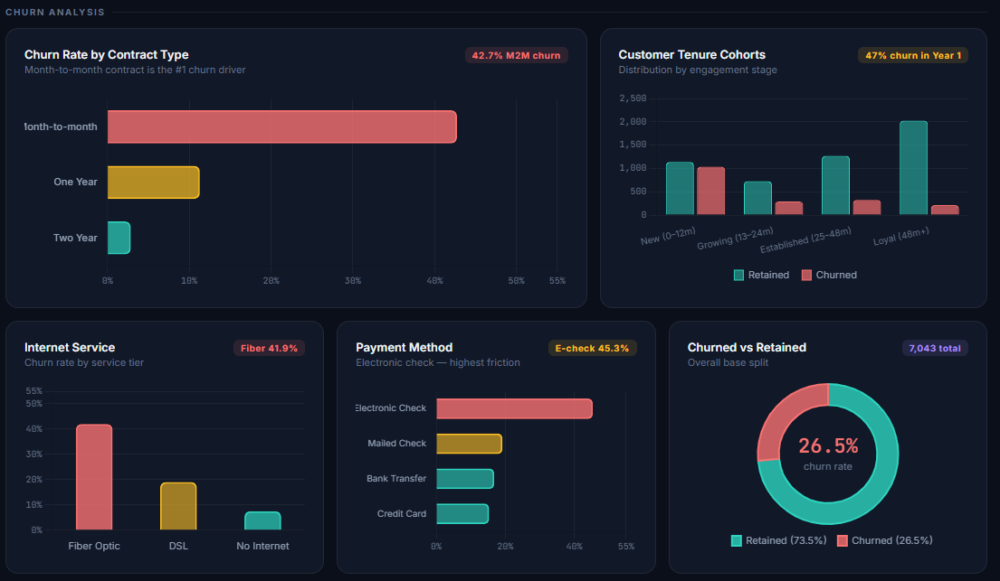
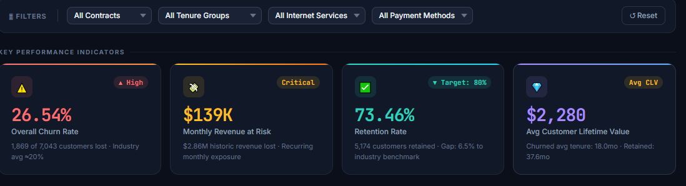
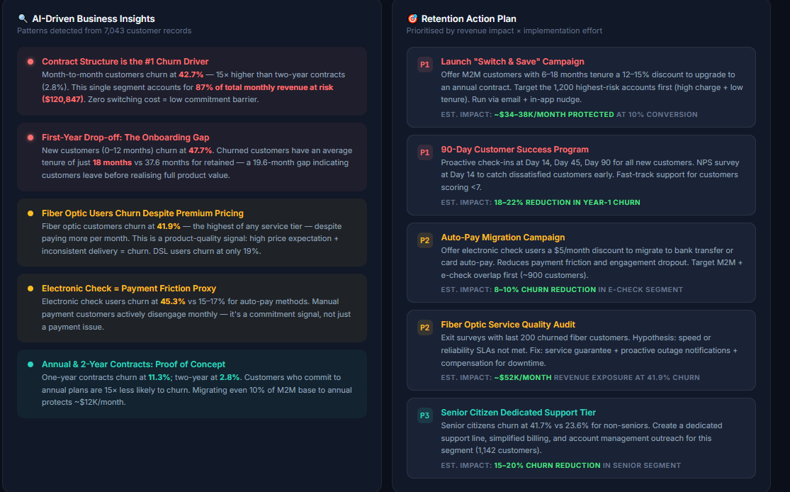
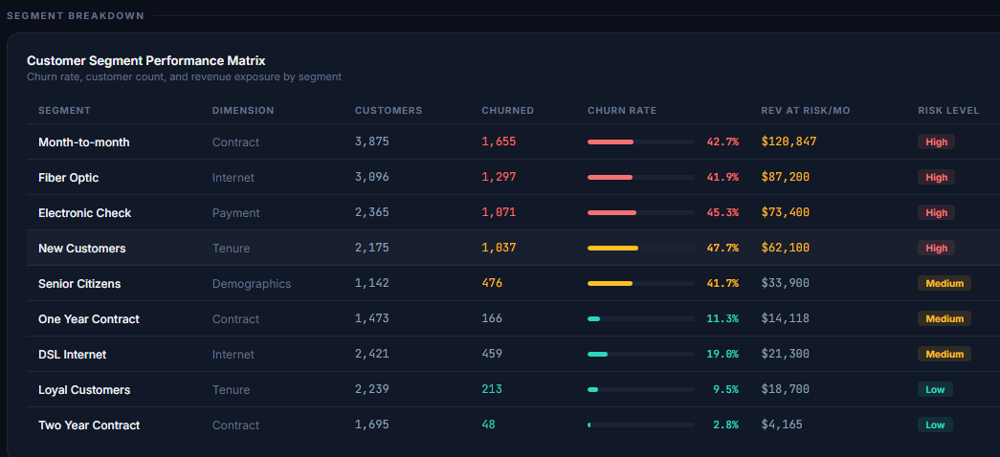

# 📊 RetailPulse 360 – Customer Churn Intelligence Platform

<p align="center">


</p>

---

# 🚀 Project Overview

RetailPulse 360 is an **end-to-end customer churn analytics project** developed to help telecom businesses identify customers who are likely to leave, quantify revenue at risk, and generate actionable business recommendations.

The project demonstrates the complete analytics lifecycle, from raw data ingestion and cleaning to business intelligence dashboards, statistical validation, cloud SQL querying, and interactive reporting.

This project is designed to showcase practical data analytics skills expected in modern organizations such as Deloitte, EY, PwC, KPMG, Accenture, Capgemini, Cognizant, Infosys, IBM, and Amazon.

---

# 🎯 Business Problem

Customer churn is one of the biggest challenges faced by subscription-based businesses.

When customers leave,

- Monthly recurring revenue decreases.
- Customer acquisition costs increase.
- Marketing budgets become less effective.
- Customer Lifetime Value (CLV) declines.
- Business profitability is negatively impacted.

The business needs a data-driven solution that can answer critical questions such as:

- Why are customers leaving?
- Which customers are most likely to churn?
- Which contract types are high risk?
- Which payment methods contribute to churn?
- How much revenue is currently at risk?
- Which customers should be prioritized for retention campaigns?

RetailPulse 360 addresses these questions through exploratory analysis, SQL analytics, statistical testing, and interactive dashboards.

---

# 🎯 Project Objectives

The primary objectives of this project are:

- Clean and prepare raw telecom customer data.
- Perform exploratory data analysis using Python.
- Build business KPIs using SQL.
- Analyze customer cohorts using advanced SQL.
- Calculate Customer Lifetime Value (CLV).
- Estimate Revenue at Risk.
- Validate churn drivers using statistical analysis.
- Build an executive Power BI dashboard.
- Develop an interactive Streamlit dashboard.
- Generate business insights and actionable recommendations.
- Demonstrate end-to-end analytics skills for a production-ready portfolio.

---

# 📂 Dataset Information

**Dataset:** IBM Telco Customer Churn Dataset

### Dataset Summary

| Metric | Value |
|---------|-------|
| Records | 7,043 |
| Features | 27 |
| Industry | Telecommunications |
| Target Variable | Customer Churn |
| Data Type | Customer Subscription Data |

The dataset contains customer demographics, subscription details, billing information, service usage, tenure, payment methods, contract information, and churn status.

---

# 🛠 Tech Stack

| Category | Technologies Used |
|------------|------------------|
| Programming | Python |
| Data Analysis | Pandas, NumPy |
| SQL | MySQL |
| Visualization | Power BI |
| Web Dashboard | Streamlit |
| Cloud Analytics | Google BigQuery |
| Statistics | R, SciPy |
| Spreadsheet Analysis | Microsoft Excel |
| Notebook | Jupyter Notebook |
| Version Control | Git & GitHub |

---

# 🏗 End-to-End Analytics Architecture

```
                Raw Telecom Dataset
                         │
                         ▼
               Python Data Cleaning
                         │
                         ▼
              Feature Engineering
                         │
                         ▼
          Cleaned Analytics Dataset
                         │
      ┌──────────────────┼──────────────────┐
      ▼                  ▼                  ▼
   SQL Analysis      Python EDA        Excel Analysis
      │                  │                  │
      └──────────────────┼──────────────────┘
                         ▼
               Statistical Validation
                (R + Hypothesis Tests)
                         │
                         ▼
              Google BigQuery Analysis
                         │
                         ▼
        Power BI Executive Dashboard
                         │
                         ▼
       Interactive Streamlit Dashboard
                         │
                         ▼
      Business Insights & Recommendations
```

---

# 📈 Analytics Workflow

The project follows a complete analytics lifecycle:

1. Data Collection
2. Data Cleaning
3. Feature Engineering
4. Exploratory Data Analysis (EDA)
5. SQL KPI Analysis
6. Cohort & Revenue Analysis
7. Statistical Validation
8. Dashboard Development
9. Business Storytelling
10. Actionable Recommendations

---

# 💼 Business Questions Answered

This project answers several key business questions:

- Which customer segments have the highest churn?
- How does contract type influence churn?
- Which payment methods have the greatest revenue risk?
- What is the impact of customer tenure on retention?
- Which customers generate the highest Customer Lifetime Value?
- What is the estimated monthly revenue at risk?
- Which customer groups should be targeted first for retention campaigns?

# 🧹 Data Cleaning & Feature Engineering

The raw telecom dataset was processed using Python to ensure high-quality data before analysis.

### Data Cleaning Steps

- Removed duplicate customer records.
- Converted `TotalCharges` to numeric format.
- Handled missing values.
- Standardized column data types.
- Verified dataset consistency.

### Feature Engineering

The following business features were created to improve analytical capabilities.

| Feature | Description |
|----------|-------------|
| Churn_Flag | Binary representation of churn (1 = Yes, 0 = No) |
| CLV | Customer Lifetime Value (Monthly Charges × Tenure) |
| TenureGroup | Customer lifecycle segmentation |
| HighValueCustomer | Customers with high monthly revenue |
| RevenueRisk | Monthly revenue at risk from churn |
| ContractRisk | High-risk vs Low-risk contract categorization |

---

# 📊 Exploratory Data Analysis (EDA)

Exploratory Data Analysis was performed using **Python, Pandas, Plotly, and SciPy**.

The objective was to identify behavioral patterns associated with customer churn.

The following analyses were completed:

- Churn by Contract Type
- Monthly Charges Distribution
- Tenure vs Monthly Charges
- Correlation Analysis
- Cohort Analysis
- Revenue Risk Analysis
- Statistical Significance Testing

---

# 📈 EDA Screenshots

## Churn by Contract



---

## Executive Dashboard


---

## KPI Summary



---

## Business Insights



---

## Customer Segmentation



---

# 🗄 SQL Analytics

The project includes advanced SQL analysis to simulate real-world business reporting.

### SQL Topics Covered

- Database Design
- Schema Creation
- Data Loading
- KPI Queries
- Aggregations
- Window Functions
- Common Table Expressions (CTEs)
- Revenue Analysis
- Cohort Analysis
- Customer Segmentation

### SQL Files

```
sql/

01_schema.sql

02_kpi_queries.sql

03_cohort_analysis.sql

04_window_functions.sql

05_revenue_at_risk.sql
```

---

# ☁ Google BigQuery

The SQL logic was also adapted for Google BigQuery to demonstrate cloud-based analytics.

Business scenarios include:

- Customer segmentation
- Revenue analysis
- Churn KPIs
- Contract analysis
- Retention reporting

---

# 📑 Excel Analysis

Microsoft Excel was used to validate analytical outputs.

Activities performed include:

- Pivot Tables
- KPI Validation
- Data Quality Checks
- Summary Reports
- Revenue Verification

---

# 📓 Jupyter Notebook

A Jupyter Notebook is included to document the exploratory workflow.

The notebook demonstrates:

- Data Import
- Cleaning
- Visualization
- Feature Engineering
- Exploratory Analysis
- Statistical Calculations

Location:

```
notebooks/churn_analysis.ipynb
```

---

# 📈 Statistical Analysis

Statistical validation was performed using **R**.

The following statistical methods were applied:

### Chi-Square Test

Purpose:

Determine whether customer contract type has a statistically significant relationship with churn.

Result:

The analysis confirmed a statistically significant association between contract type and customer churn.

---

### Logistic Regression

A logistic regression model was developed to estimate customer churn probability.

Important predictors identified include:

- Contract Type
- Monthly Charges
- Customer Tenure
- Payment Method
- Internet Service
- Senior Citizen Status

---

# 📌 Key Performance Indicators

The project calculates several business KPIs.

| KPI | Description |
|------|-------------|
| Churn Rate | Percentage of customers who left |
| Retention Rate | Percentage of customers retained |
| Revenue at Risk | Monthly revenue exposed to churn |
| Customer Lifetime Value | Estimated customer value |
| High Risk Customers | Customers likely to churn |
| Revenue Lost | Estimated historical revenue loss |

---

# 📂 Project Structure

```
Customer-Churn-Analytics/

│

├── assets/

│ └── screenshots/

│

├── dashboard/

│ ├── churn_dashboard.pbix

│ └── churn_dashboard.html

│

├── python/

│ ├── 01_data_cleaning.py

│ └── 02_eda.py

│

├── sql/

│ ├── 01_schema.sql

│ ├── 02_kpi_queries.sql

│ ├── 03_cohort_analysis.sql

│ ├── 04_window_functions.sql

│ └── 05_revenue_at_risk.sql

│

├── r_analysis/

│

├── notebooks/

│

├── deployment/

│

├── reports/

│

└── README.md

# 📊 Executive Dashboard

The project includes an executive dashboard built to help business stakeholders monitor customer churn, revenue impact, customer value, and retention opportunities.

The dashboard is designed using modern business intelligence principles:

- Executive KPI cards
- Interactive filters
- Business storytelling
- Revenue-focused visualizations
- Actionable recommendations
- Clean, minimal layout

---

# 🖥 Dashboard Preview

## Executive Overview


This page provides executives with a quick understanding of customer retention performance through key KPIs and high-level business metrics.

---

## KPI Dashboard


### KPIs Included

- Total Customers
- Churn Rate
- Retention Rate
- Revenue at Risk
- Customer Lifetime Value (CLV)

These KPIs help management understand the current business performance at a glance.

---

## Churn Analysis Dashboard


Visualizations include:

- Churn by Contract Type
- Revenue at Risk by Payment Method
- Customer Distribution
- Tenure Analysis
- Monthly Charges Analysis

These charts explain where churn occurs and which customer groups contribute most to revenue loss.

---

## Customer Segmentation


Customers are segmented into meaningful business groups such as:

- New Customers
- Growing Customers
- Established Customers
- Loyal Customers

Segmentation helps prioritize retention campaigns.

---

## Business Insights Dashboard


Instead of displaying only charts, the dashboard explains:

### What happened?

Example:

> Customer churn reached approximately **27%**, with Month-to-Month customers contributing the largest share.

---

### Why did it happen?

Analysis shows:

- Flexible contracts increase switching behavior.
- Higher monthly charges increase churn probability.
- Customers with shorter tenure are less loyal.

---

### Who is responsible?

Highest-risk customer segments include:

- Month-to-Month contracts
- Electronic Check payment users
- Fiber Optic customers
- New customers (<12 months)

---

### Business Impact

The business is losing significant recurring monthly revenue because high-value customers leave before reaching their full lifetime value.

---

### Recommended Actions

Immediate priorities include:

- Convert Month-to-Month customers into annual contracts.
- Offer discounts for AutoPay enrollment.
- Launch early retention campaigns for new customers.
- Improve Fiber Optic customer experience.
- Build loyalty programs for customers with high CLV.

---

# 📈 Key Business Insights

## Insight 1

### What happened?

Month-to-Month customers experience the highest churn rate.

### Why?

Customers have no long-term commitment and can easily switch providers.

### Business Recommendation

Provide discounted annual plans and loyalty rewards.

---

## Insight 2

### What happened?

Customers paying through Electronic Check churn significantly more.

### Why?

Electronic payment friction creates poor customer experience.

### Business Recommendation

Encourage AutoPay migration with incentives.

---

## Insight 3

### What happened?

Customers with low tenure leave more frequently.

### Why?

They fail to build long-term engagement.

### Business Recommendation

Launch onboarding campaigns during the first 90 days.

---

## Insight 4

### What happened?

High Monthly Charges increase churn probability.

### Why?

Customers perceive lower value for money.

### Business Recommendation

Offer bundled plans and personalized pricing.

---

## Insight 5

### What happened?

Fiber Optic customers generate high revenue but also exhibit higher churn.

### Why?

Higher customer expectations and service issues.

### Business Recommendation

Improve service quality and proactive technical support.

---

# 💡 Business Recommendations

## High Priority

- Target Month-to-Month customers with contract upgrade campaigns.
- Reduce churn among Electronic Check users.
- Identify high CLV customers before churn occurs.
- Monitor customers with tenure below 12 months.

---

## Medium Priority

- Improve Fiber Optic customer satisfaction.
- Launch personalized retention campaigns.
- Promote AutoPay enrollment.
- Increase customer engagement during onboarding.

---

## Long-Term Strategy

- Develop AI-powered churn prediction models.
- Deploy automated retention workflows.
- Personalize offers based on CLV.
- Monitor churn using real-time dashboards.

---

# 🎯 Business Value Delivered

This project demonstrates how analytics can help organizations:

✅ Reduce customer churn

✅ Increase customer lifetime value

✅ Protect recurring revenue

✅ Improve retention strategies

✅ Support executive decision-making

✅ Prioritize high-value customers

✅ Optimize marketing investments

---

# 🌟 Skills Demonstrated

### Data Analytics

- Data Cleaning
- Data Transformation
- Feature Engineering
- Exploratory Data Analysis

---

### SQL

- Complex Queries
- Window Functions
- Common Table Expressions
- KPI Reporting
- Customer Segmentation

---

### Business Intelligence

- Power BI
- Streamlit
- Dashboard Design
- KPI Reporting
- Executive Storytelling

---

### Programming

- Python
- Pandas
- NumPy
- Plotly

---

### Statistics

- Hypothesis Testing
- Chi-Square Test
- Logistic Regression

---

### Cloud Analytics

- Google BigQuery

---

### Version Control

- Git
- GitHub

# 🚀 Installation Guide

## 1. Clone Repository

```bash
git clone https://github.com/YOUR_USERNAME/Customer-Churn-Analytics.git
```

---

## 2. Move into Project Folder

```bash
cd Customer-Churn-Analytics
```

---

## 3. Install Python Packages

```bash
pip install -r deployment/requirements.txt
```

---

## 4. Run Streamlit Dashboard

```bash
streamlit run deployment/app.py
```

---

## 5. Open Power BI Dashboard

Open:

```
dashboard/churn_dashboard.pbix
```

using Microsoft Power BI Desktop.

---

## 6. Execute SQL Scripts

Run in the following order:

```
01_schema.sql

02_kpi_queries.sql

03_cohort_analysis.sql

04_window_functions.sql

05_revenue_at_risk.sql
```

---

## 7. Execute Python

```
python python/01_data_cleaning.py

python python/02_eda.py
```

---

## 8. Run R Analysis

```
01_hypothesis_testing.R

02_logistic_regression.R
```

using RStudio.

---

# 📁 Repository Structure

```
Customer-Churn-Analytics/

│

├── assets/

│

├── dashboard/

│

├── data/

│

├── deployment/

│

├── notebooks/

│

├── python/

│

├── r_analysis/

│

├── sql/

│

├── reports/

│

└── README.md
```

---

# 📌 Future Enhancements

Potential improvements include:

- Machine Learning models (XGBoost, Random Forest)
- Customer churn prediction API
- Automated retention recommendations
- Azure / AWS deployment
- Snowflake integration
- Apache Airflow ETL pipelines
- dbt transformations
- Real-time dashboards

---

# 🎓 Learning Outcomes

Through this project I strengthened my skills in:

- Business Problem Solving
- Data Cleaning
- Data Wrangling
- Feature Engineering
- Exploratory Data Analysis
- SQL Analytics
- Power BI Dashboarding
- Streamlit Dashboard Development
- Statistical Analysis in R
- Business Storytelling
- Executive Reporting

---

# 👨‍💻 About the Author

**Shaik Kashida Jabeen**

Electronics & Communication Engineering Graduate (2025)

Aspiring Data Analyst

Skilled in:

- SQL
- Python
- Power BI
- Excel
- Streamlit
- R
- Google BigQuery

Interested in:

- Data Analytics
- Business Intelligence
- Product Analytics
- Financial Analytics
- Customer Analytics

---

# 📬 Connect With Me

### LinkedIn
[LinkedIn](https://www.linkedin.com/in/shaik-kashida-jabeen-2130abc/?isSelfProfile=false)

### GitHub
[GitHub](https://github.com/Shaikkashida)

### Email
Kashukash73@gmail.com

---

# ⭐ If you found this project useful...

Please consider giving it a ⭐ on GitHub.

---

# 📄 License

This project is intended for educational and portfolio purposes.

---

## Thank You

Thank you for exploring **RetailPulse 360 – Customer Churn Intelligence Platform**.

This project demonstrates how data analytics can transform raw customer data into actionable business insights that support executive decision-making and revenue growth.